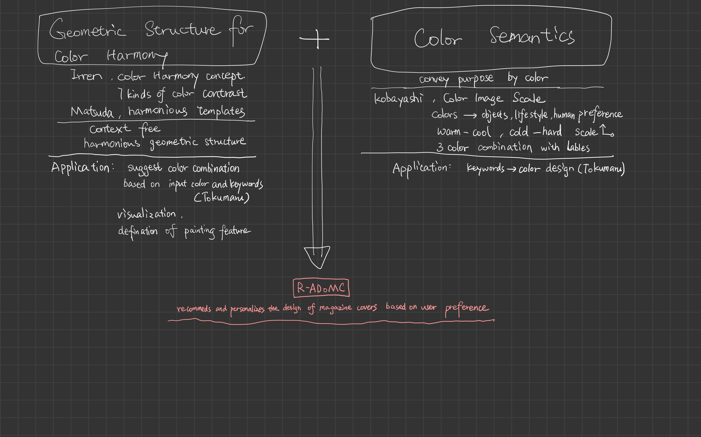

# 第一周作业
## 1，学习笔记
论文：  
*Automatic Design of Colors for Magazine Covers*  
**杂志封面的自动配色**

http://people.csail.mit.edu/jahanian/papers/Jahanian_ColorDesign_ADoMC_EI2013.pdf

## 2，软件架构图

## 3，代码骨架
老师，这我真的不太会

