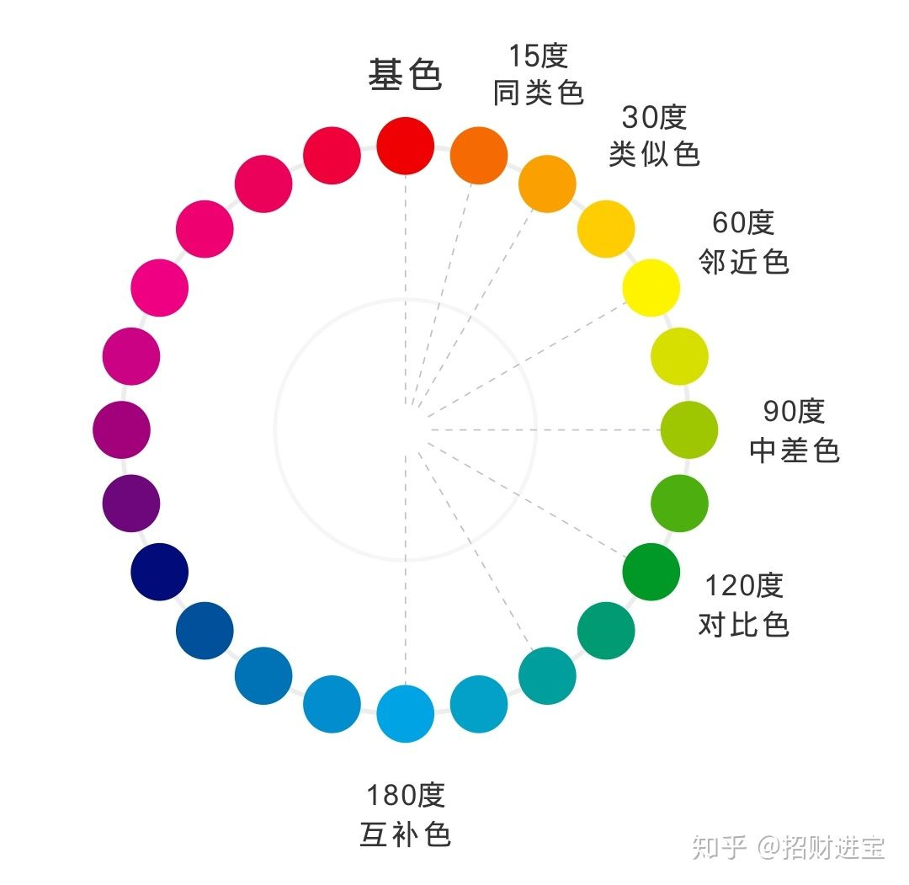

# 自己设计一个自动配色算法

## 应用场景设想
场景和衣服的颜色搭配。  
用户提供场景的主颜色，系统给出和这个场景搭配的三个衣服颜色以及配饰的颜色。  
应用下图色彩环，以输入的场景颜色为基色，首先计算其互补色为第一个衣服颜色，再计算此颜色的左右两个同类色作为第二、三个衣服颜色，最后计算此颜色的顺时针对比色，作为配饰颜色，以突出衣服颜色。

## 思路
1，输入rgb值，转化为hsv  
2，根据h值给出色相分类，返回色相类型（为场景所属色相分类）  
3，根据色相按照预定的色相环给出互补色（作为第一衣服颜色）  
4，给出互补色左右两个同类色（作为第二第三衣服颜色） 和 对比色（作为配饰颜色）  
6，将这四个颜色的hsv转化为rgb，返回rgb值并可视化
  
缺陷：只有h值的变化，返回的颜色也只是最饱和的一环上既定的颜色，后续可以添加sv值的变化以及更细腻的h分类
 
 
# 代码骨架

